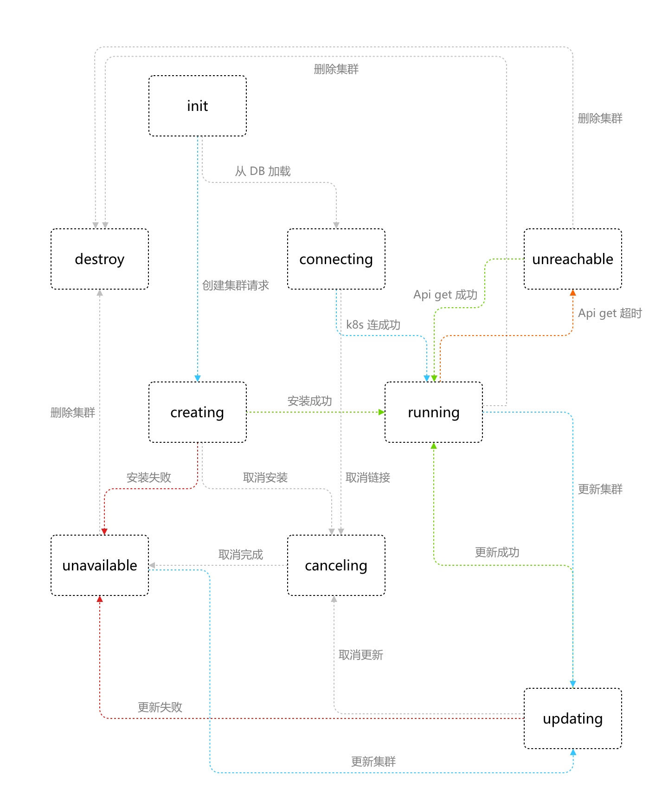

# SingleCloud集群管理设计文档
## 接口概览
singlecloud集群管理功能接口包括：
1. 集群创建
2. 集群更新（仅支持增加或删除节点）
3. 查看集群
4. 查看所有集群
5. 查看所有可用集群
6. 删除集群
7. 查看集群日志（创建或更新日志）
8. 取消（取消创建、更新或链接）
9. 导出集群kubeconfig文件（仅内部调试使用）
10. 导入集群（仅支持zke创建的集群）
其中查看集群日志为websocket接口、集群取消、导出集群kubeconfig和导入集群功能为Action接口

## 集群状态机
因集群状态及集群相关操作事件种类较多，故集群状态维护采用有限状态机进行实现，状态转移图如下所示：

其中外部可见的状态有：Creating、Connecting、Updating、Unavailable、Unreachable、Running、Canceling（目前不可见）
集群状态总体分为两大类：unready和ready，unready表示集群不可用，尚未初始化完成，unready状态下的集群的子资源接口不可用；ready表示集群已完成初始化，子资源接口可用
unready包括的状态有：Creating、Connecting、Updating、Unavailable、Canceling
ready包括的状态有：Unreachable、Running

## API
### 创建集群
1. 用户校验：校验请求的发起者是否为admin，仅admin可以创建集群
2. 检查集群名称是否重复，若已存在同名集群，则返回duplicate cluster错误
3. 执行集群配置校验
4. 将集群配置保存至db，并初始化一个Init状态的集群，加入到singlecloud unready集群列表中
5. 起一个goroutinue调用zke异步进行集群创建并向该集群的状态机发送一条create事件，集群状态机收到creating事件后，会将集群状态修改为creating
6. 返回response
### 更新集群
1. 用户校验：校验请求的发起者是否为admin，仅admin可以创建集群
2. 检查更新的集群是否存在，若不存在，则返回资源不存在错误
3. 执行集群配置校验
4. 从update请求中的集群配置中提取nodes信息，并更新该集群现有配置的nodes信息
说明：其他集群配置项默认丢弃，只提取update请求中的节点配置
4. 将更新后的集群配置保存至db，并将该集群从ready集群列表move到unready集群列表中
5. 起一个goroutinue调用zke异步进行集群的更新，并向该集群的状态机发送一条update事件，集群状态机收到事件后，将集群状态修改为updating
6. 返回response
### 查看所有可用集群
在获取集群列表请求URL最后添加`onlyready=true`flag即可，示例如下：
`curl http://127.0.0.1:8088/apis/zcloud.cn/v1/clusters?onlyready=true`
### 集群取消
集群取消操作指取消安装、取消更新或取消连接，只能在creating、updating和connecting状态下执行，其他状态下执行会返回错误信息，提示在当前状态下取消接口不可用
1. 用户校验：校验请求的发起者是否为admin，仅admin可以创建集群
2. 检查更新的集群是否存在，若不存在，则返回资源不存在错误
3. 执行集群的cancel函数，并向该集群状态机发送取消事件，状态机收到取消事件后会将集群状态置为Canceling
4. 向集群状态机发送取消成功事件，集群状态机收到取消成功事件后会将集群状态置为Unavailable

说明：当前取消和取消成功事件的发送无间隔，所以实际前端看不到Canceling状态，实际上取消操作后，后端的zke goroutinue、集群connecting goroutinue会延时退出，退出时间大致在10s内，当前zke的取消逻辑为检测到取消操作后，返回error、无法区分是安装/更新失败还是取消成功事件，后期zke添加汇报安装和更新进度功能时会支持取消成功事件的异步发送，届时Canceling状态可见
### 查看集群日志
通过websocket方式向前端推送安装或更新日志，仅在Creating和Updating状态下可以打开，后端采用一个string channel对zke日志进行回滚记录，channel长度为50（即首次打开日志窗口最多可看到50条日志）
一个集群目前只支持一个websocket连接，即不能两个浏览器同时查看同一个集群的日志，打开新的日志窗口时会自动关闭之前的websocket连接
集群日志websocket url：
`ws://\<singlecloud address>apis/ws.zcloud.cn/v1/clusters/wang/zkelog`
说明：已经显示过的日志不会缓存，即每次打开日志窗口看到的都是没有看过的日志
### 导出集群kubeconfig配置
通过前端UI创建的集群没有kubeconfig配置文件，对于想通过kubectl与k8s交互只能通过集群命令行实现，对于测试及内部调试不是很方便，故提供了一个集群的action api以及命令行工具可以获取集群的kubeconfig配置，同时该api也仅只有admin用户可以调用
获取kubeconfig方法如下：
```
cd singlecloud/cmd/getkubeconfig
go build getkubeconfig.go
usage:
./getkubeconfig -server <singlecloud address> -cluster <cluster name> -passwd <admin password>
```
执行命令后会在工具当前目录下生成对应集群的kubeconfig文件
### 导入集群
对于使用zke创建的集群，可通过importer工具导入singlecloud，导入后的集群与通过UI创建的集群无区别，导入工具代码路径：`singlecloud/cmd/importer`
```
usage
./importer -clusterstate <cluter.zkestate文件> -server <singlecloud addr> -passwd <admin password>
```

## 其他
### 集群配置校验逻辑
    * 集群option是否有空值：集群名称、ssh用户名、ssh私钥、singlecloud地址、集群域名后缀是否为空
    * 节点option校验：name、address和roles是否有空值；角色是否冲突（controlplane和worker互斥，etcd和edge不能单独存在，需依赖于controlplane或worker，即一个节点必须为controlplane或者worker节点）
    * 是否存在重复节点：两个节点的地址或名称相同
    * 节点数量校验：一个集群至少包含一个主节点、一个etcd节点和一个工作节点