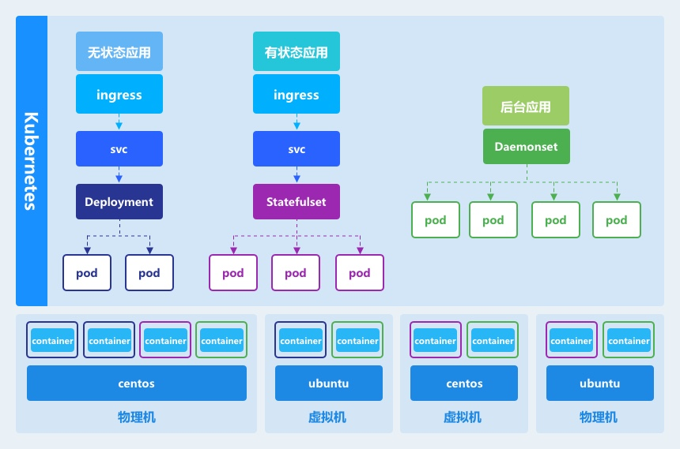

## 功能介绍

Zcloud作为企业级的容器云管理平台，为用户提供了一个具备极致体验的 Web 控制台，让您能够像使用任何其他互联网产品一样，快速上手各项功能与服务。Zcloud目前提供了集群管理、容器管理、应用商店、应用管理、基础资源管理、资源申请、镜像仓库、监控中心等功能模块，并开发了自己的存储与网络方案。支持对接多种开源的存储与网络方案，支持高性能的商业存储与网络服务。核心功能如下图所示：

以下从专业的角度为您详解各个模块的功能服务：

## 总览

通过简易的UI操作，支持多集群管理，包括集群创建、集群删除、节点添加、节点删除、集群命令行等操作。

## 集群管理

对指定集群进行相关的资源进行管理，包括集群使用资源查看，命名空间查看，节点信息查看，网络使用信息查看。对集群的存储进行管理，比如创建存储，存储扩缩容。存储支持两种类型，本地存储（LVM），网络存储（Ceph）。

### 命名空间

当一个集群需要支持多租户或支持资源隔离时，管理员可以使用命名空间功能创建多个虚拟集群。每一个命名空间的资源都是相互隔离的。同一个用户可以拥有多个命名空间的操作权限。

### 节点管理

节点是集群中的工作节点。一个Node可以是VM或物理机或云主机。每个节点具有运行POD的一些必要服务，并由控制节点进行统一管理，节点上的服务包括Docker、kubelet和kube-proxy等等。Zcloud为节点定义了2种分类（控制节点，工作节点），2种角色：ETCD，边界。

**控制节点：**用于控制整个集群，控制节点建议是多个，根据选举算法，同时只有一个控制节点在工作，当此节点出现问题时，工作的控制节点会被切换。

**工作节点：**工作节点也称作集群的调度节点，集群内部所有的应用都运行在工作节点上，不会被调度到控制节点上。

**ETCD：**用于存储整个集群的配置数据，ETCD是一个k-v数据库，其容错表见集群部署相关介绍。ETCD的角色可以标记在控制节点上，也可以标记在工作节点上。

**边界：**边界角色只能标记在工作节点上，它是集群对外暴露的节点，负责接受与转发所有集群外部的请求。

### 存储管理

使用操Operator管理存储集群。Operator使传统上可能由集群管理员操作的命令可自动化实现。无论集群管理员需要什么操作来设置存储集群，Operator都将自动完成。具体原理如下：

在集群中增加一个关于存储的CRD：cluster，然后部署一个operator（资源控制器）pod从API中获取该资源的对象，通过对存储集群组件、CSI和storageclass等资源进行一系列操作，最终完成存储的创建，为用户提供storageclass。这种设计简化了用户使用存储的复杂性，用户只需为某种类型的存储指定一个或多个存储节点，即可完成创建对应的storageclass，供用户通过pvc来申请使用。

目前支持两种类型的存储本地存储（LVM），网络存储（Cephfs），存储节点上只要有可用的块设备即可在创建时自动加入存储集群。

### 网络管理

支持三种CNI网络，Flannel，Calico，Mac vlan + DHCP。

Flannel：它提供了一个简单的VXLAN网络模型，用户只需要一些基础知识，就可以设置适合大多数用例的环境。一般来说，在初期使用Flannel是一个稳妥安全的选择。

Calico：虽然Flannel被公认为是最简单的选择，但Calico以其性能、灵活性而闻名。Calico的功能更为全面，不仅提供主机和pod之间的网络连接，还涉及网络安全和管理。

Mac vlan + DHCP：为用户提供扁平化的网络模型，所有集群内部的POD IP都使用与节点相同IP段。

##  应用管理

对使用应用模版部署的应用进行管理，比如应用的删除、更新等操作。同时支持对应用的相关资源进行关系展示。

**应用列表：**管理通过Zcloud部署的容器编排服务。支持升级与删除操作。

**应用拓扑：**通过对用户数据请求链路的分析，提供准确的资源关联关系图。使用户一目了然的了解集群中的每一个服务所关联的资源。及时发现故服务的障点。

##  应用商店

通过改良后的Helm技术，支持使用应用模版一键部署应用。在集群中部署容器云应用（容器或微服务编排）是一项有挑战性的工作，应用商店就是为了简化在集群中安装部署容器云应用的一个客户端工具。通过应用商店能够帮助开发者便捷的安装和升级集群中的容器云应用。同时，也可以通过应用商店进行容器云应用的分享。

## 基础资源

对底层 Kubernetes 中的多种类型的资源提供极简的图形化向导式 UI ，其中包括：无状态副本（Deployment ）、有状态副本（StatefulSet）、守护进程、定时任务、任务、服务、服务入口、UDP服务入口、配置字典、保密字典等。

如上图所示，集群的基本组成是每一个节点服务器。服务器可以是物理机或虚拟机，需要安装Linux操作系统，例如Ubuntu，CentOS等，同时需要安装Docker。每一个POD所包含的容器会被集群调度不同节点上。

用Deployment 来举例，如果想对用户提供服务，需要进行以下三步：

**计算资源创建：**Deployment 被创建后，其处理用户请求的计算资源POD会全部创建，创建的数目取决于在Deployment 指定的副本数。

**提供集群内部服务：**这些计算资源为集群内部的其他应用进行服务时，需要创建一个svc与Deployment 进行关联。通过集群的服务发现机制，其他应用只需要指定服务名称就可以访问到Deployment 提供的计算服务。创建svc时，集群会自动配置负载均衡，用户请求会均匀分布到各个POD上。

**提供集群外部服务：**集群内部的服务想要暴露在集群外部，有两种方式，

1、svc指定Nodeport类型，这样集群内部服务会直接暴露到节点端口上。这样的方式存在安全隐患。

2、需要创建一个ingress与svc进行关联，ingress可以根据不同的域名，不同的路径，把用户请求路由到不同的svc上。同时ingress支持UDP的服务类型。

## 资源申请

管理对可以通过普通用户的资源申请，进行整个集群的资源分配管理。方便记录资源与回收资源。

## 用户管理

Zcloud支持多租户，通过对用户的二级管理，实现租户间的资源隔离。通过对普通用户权限的细粒度划分，有效的做到了资源的安全控制。同时支持统一认证登录。

## 镜像仓库

支持用户的私有镜像仓库的搭建，方便用户对镜像进行统一管理，支持安全扫描，解决用户镜像的安全问题。

## 监控中心

实现对用户所有资源的监控与采样分析，从节点，到集群，到命名空间，到集群资源，到POD，到容器的每一层细粒度的监控。
