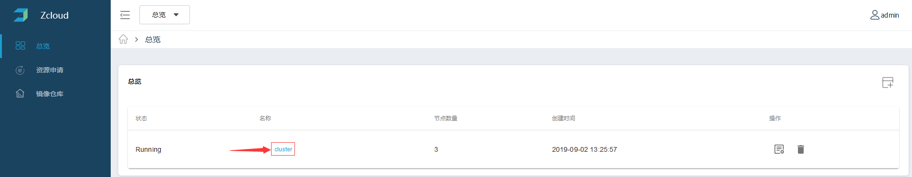
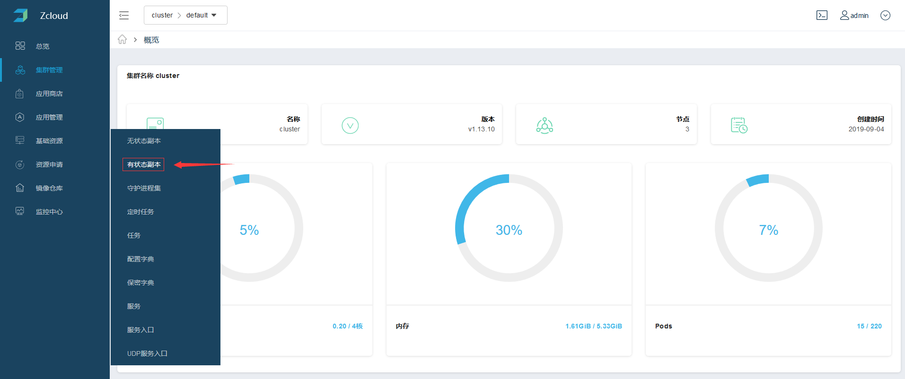
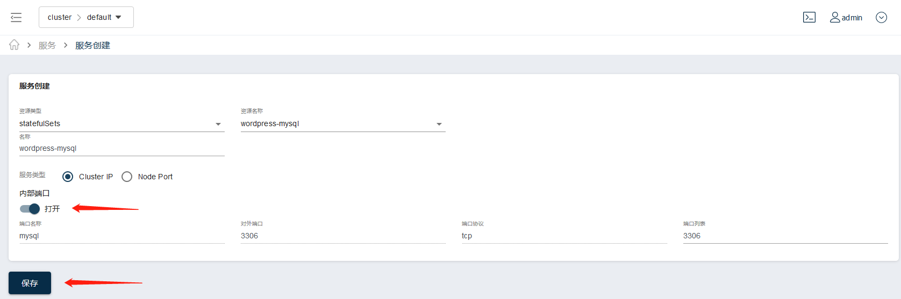

## 部署MySQL

1、选择集群

2、选择左侧菜单基础资源中的有状态副本

3、创建有状态副本

**创建页面按如下内容进行填写**

名称：wordpress-mysql

副本数：1

容器名称：wordpress-mysql

镜像：mysql:5.6

**在容器一节，单击环境变量**

键：MYSQL_ROOT_PASSWORD

值：zcloud

**在容器一节，单击开放端口**

端口名称：mysql

端口：3306

**在存储卷一节，单击添加存储：**

模版名称：mysql-storage

存储大小：1

存储类型：lvm

**在容器一节，单击添加存储卷：**

存储卷类型：存储卷

存储卷名称：mysql-storage

挂在路径：/var/lib/mysql

单击保存，如图所示：

4、部署mysql svc

在弹出的对话框中选择确定，进入Mysql服务的创建页面。

单击内部端口打开按钮，保存即可。在弹出的提示框中选择取消。

