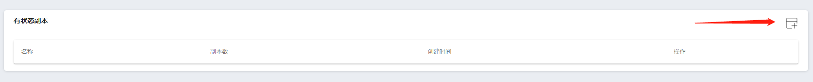
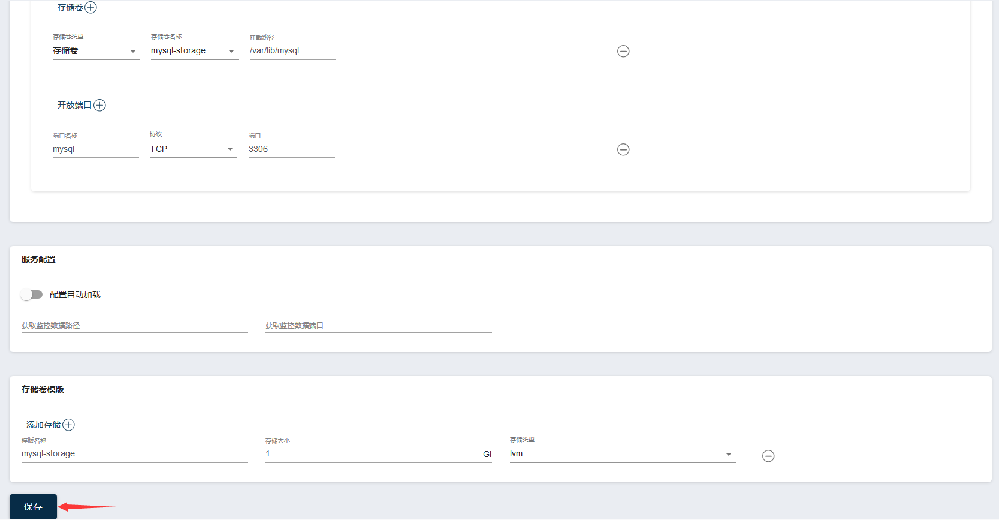

title: "快速入门"
metaTitle: "快速入门"
metaDescription: "快速入门"

## 快速入门

本教程将指导您完成:

- 部署一个数据库，Mysql；

- 部署一个应用程序，Wordpress；

操作本教程之前，默认您已经完成Zcloud的部署，并已登录Zcloud。

## 部署Mysql

1、选择集群

2、选择左侧菜单基础资源中的有状态副本

3、创建有状态副本

**创建页面按如下内容进行填写**

名称：wordpress-mysql

副本数：1

容器名称：wordpress-mysql

镜像：mysql:5.6

**在容器一节，单击环境变量**

键：MYSQL_ROOT_PASSWORD

值：zcloud

**在容器一节，单击开放端口**

端口名称：mysql

端口：3306

**在存储卷一节，单击添加存储：**

模版名称：mysql-storage

存储大小：1

存储类型：lvm

**在容器一节，单击添加存储卷：**

存储卷类型：存储卷

存储卷名称：mysql-storage

挂在路径：/var/lib/mysql

单击保存，如图所示：

4、部署mysql svc

在弹出的对话框中选择确定，进入Mysql服务的创建页面。

单击内部端口打开按钮，保存即可。在弹出的提示框中选择取消。

## 部署wordpress
1、选择左侧菜单基础资源中的有状态副本

2、创建无状态副本

**创建页面按如下内容进行填写**

名称：wordpress

副本数：1

容器名称：wordpress

镜像：wordpress:4.8-apache

**在容器一节，单击环境变量两次**

键：WORDPRESS_DB_HOST

值：wordpress-mysql

键：WORDPRESS_DB_PASSWORD

值：zcloud

**在容器一节，单击开放端口**

端口名称：http

端口：80

**在存储卷一节，单击添加存储：**

模版名称：wordpress-storage

存储大小：1

存储类型：lvm

**在容器一节，单击添加存储卷：**

存储卷类型：存储卷

存储卷名称：wordpress-storage

挂在路径：/var/www/html

单击保存，如图所示：

3、部署wordpress svc

在弹出的对话框中选择确定，进入Mysql服务的创建页面。

单击内部端口打开按钮，保存即可。在弹出的提示框中“服务已创建成功，是否创建关联访问入口？”选择确定。

4、部署wordpress ingress

名称：wordpress

域名：192.168.218.130.zc.zdns.cn

路径：/

其中域名的规则为边界节点IP.zc.zdns.cn。

添加访问入口路径，如下图：

## 访问wordpress

浏览器地址栏输入：http://192.168.218.130.zc.zdns.cn，如下图所示：

开启你的wordpress之旅吧！

