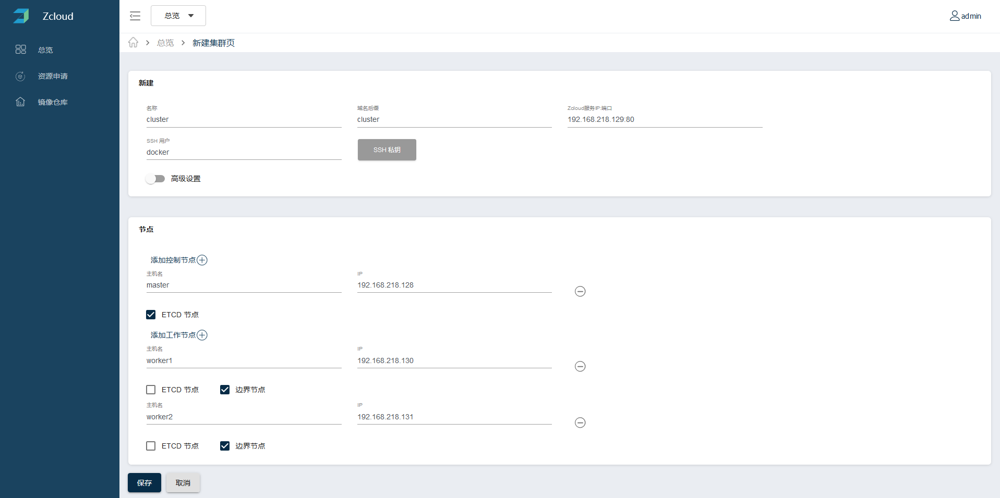
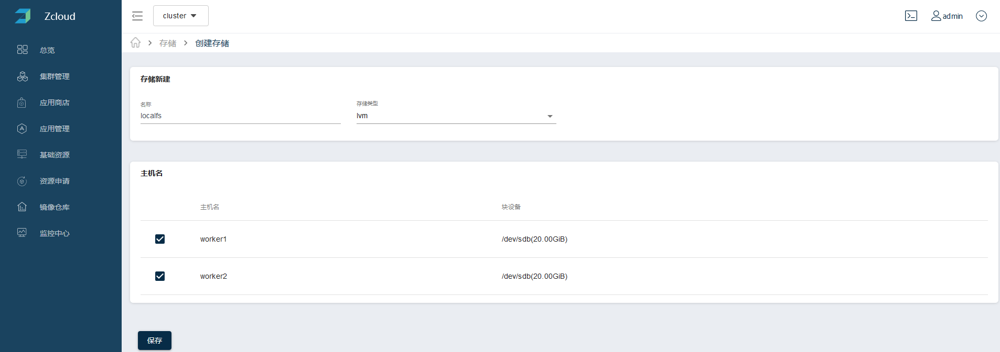

## 基础环境配置

1、配置要求

您的主机可以是：

- 云主机
- 本地虚拟机
- 本地物理机

**注意**:在使用云主机时，您需要允许TCP/80和TCP/443入站通信端口。

**硬件需求**：

- CPU: 2C
- 内存: 4GB

**注意**:此配置仅为满足小规模测试环境的最低配置。

2、主机名配置

因为K8S的规定，主机名只支持包含 `-` 和 `.`(中横线和点)两种特殊符号，并且主机名不能出现重复。

3、Hosts

配置每台主机的hosts(/etc/hosts),添加`host_ip $hostname`到`/etc/hosts`文件中。

4、CentOS关闭selinux

```
sudo sed -i 's/SELINUX=enforcing/SELINUX=disabled/g' /etc/selinux/config
```

5、关闭防火墙(可选)或者放行相应端口

对于刚刚接触Zcloud的用户，建议在关闭防火墙的测试环境或桌面虚拟机来运行Zcloud，以避免出现网络通信问题。

* 关闭防火墙

  * CentOS
  
    ```
    systemctl stop firewalld.service && systemctl disable firewalld.service
    ```
  
  * Ubuntu
  
    ```
    ufw disable
    ```

6、配置主机时间、时区、系统语言

* 查看时区

```
date -R`或者`timedatectl
```

* 修改时区

```
ln -sf /usr/share/zoneinfo/Asia/Shanghai /etc/localtime
```

* 修改系统语言环境

```
sudo echo 'LANG="en_US.UTF-8"' >> /etc/profile;source /etc/profile
```

* 配置主机NTP时间同步

7、Kernel性能调优

```
cat >> /etc/sysctl.conf<<EOF
net.ipv4.ip_forward=1
net.bridge.bridge-nf-call-iptables=1
net.ipv4.neigh.default.gc_thresh1=4096
net.ipv4.neigh.default.gc_thresh2=6144
net.ipv4.neigh.default.gc_thresh3=8192
EOF
```

数值根据实际环境自行配置，最后执行`sysctl -p`保存配置。

8、内核模块

**警告**如果要使用ceph存储相关功能，需保证worker节点加载RBD模块

以下模块需要在主机上加载

| **模块名称**           |
| ---------------------- |
| br_netfilter           |
| ip6_udp_tunnel         |
| ip_set                 |
| ip_set_hash_ip         |
| ip_set_hash_net        |
| iptable_filter         |
| iptable_nat            |
| iptable_mangle         |
| iptable_raw            |
| nf_conntrack_netlink   |
| nf_conntrack           |
| nf_conntrack_ipv4      |
| nf_defrag_ipv4         |
| nf_nat                 |
| nf_nat_ipv4            |
| nf_nat_masquerade_ipv4 |
| nfnetlink              |
| udp_tunnel             |
| VETH                   |
| VXLAN                  |
| x_tables               |
| xt_addrtype            |
| xt_conntrack           |
| xt_comment             |
| xt_mark                |
| xt_multiport           |
| xt_nat                 |
| xt_recent              |
| xt_set                 |
| xt_statistic           |
| xt_tcpudp              |

模块查询: lsmod | grep <模块名> 
 模块加载: modprobe <模块名>

## 节点需求

### 操作系统和Docker

Zcloud在以下操作系统及其后续的非主要发行版上受支持:

- Ubuntu 16.04.x (64-bit)
  - Docker 17.03.x, 18.06.x,       18.09.x
- Ubuntu 18.04.x (64-bit)
  - Docker 18.06.x, 18.09.x
- Red Hat Enterprise Linux      (RHEL)/CentOS 7.4+ (64-bit)
  - Docker 17.03.x, 18.06.x,       18.09.x
- Windows Server version 1803      (64-bit)
  - Docker 17.06

Ubuntu、Centos操作系统有Desktop和Server版本，选择请安装server版本.

### 网络

节点IP地址

使用的每个节点应配置静态IP。在DHCP的情况下，应配置DHCP IP保留以确保节点获得相同的IP分配。

端口需求

必须打开的端口根据托管集群节点的计算机类型而变化，例如，如果要在基础结构托管的节点上部署Zcloud，则必须为SSH打开`22`端口。

### 免密登录

最佳体验集群规划共需要4台机器，具体使用如下：

运行Zcloud控制节点1台，运行k8s集群3台，其中1台为集群的控制节点，另外2台为工作节点。工作节点除系统盘外，必须有其它未使用的块存储设备。

需要在Zcloud的控制节点进行ssh免密登录其它3台机器。具体命令如下：

```
ssh-keygen -t rsa
ssh-copy-id -i ~/.ssh/id_rsa.pub username@IP1
ssh-copy-id -i ~/.ssh/id_rsa.pub username@IP2
ssh-copy-id -i ~/.ssh/id_rsa.pub username@IP3
```

保存好~/.ssh/id_rsa，创建集群的时候需要用到。为防止错误发生，最好整个文件整体下载保存，不要复制粘贴内容进行保存，更不要新建txt等任何文本格式的文件进行保存。

**注意：Zcloud控制节点不能使用集群内部的服务器，切记！**

## Docker安装与配置

1、Docker安装

Ubuntu 16.x

* **修改系统源**

```
sudo cp /etc/apt/sources.list /etc/apt/sources.list.bak
cat > /etc/apt/sources.list << EOF
     
deb http://mirrors.aliyun.com/ubuntu/ xenial main
deb-src http://mirrors.aliyun.com/ubuntu/ xenial main
deb http://mirrors.aliyun.com/ubuntu/ xenial-updates main
deb-src http://mirrors.aliyun.com/ubuntu/ xenial-updates main
deb http://mirrors.aliyun.com/ubuntu/ xenial universe
deb-src http://mirrors.aliyun.com/ubuntu/ xenial universe
deb http://mirrors.aliyun.com/ubuntu/ xenial-updates universe
deb-src http://mirrors.aliyun.com/ubuntu/ xenial-updates universe
deb http://mirrors.aliyun.com/ubuntu/ xenial-security main
deb-src http://mirrors.aliyun.com/ubuntu/ xenial-security main
deb http://mirrors.aliyun.com/ubuntu/ xenial-security universe
deb-src http://mirrors.aliyun.com/ubuntu/ xenial-security universe        
EOF
```

* **Docker-ce****安装**

```
# 定义安装版本
export docker_version=18.06.3;
# step 1: 安装必要的一些系统工具
sudo apt-get remove docker docker-engine docker.io containerd runc -y;
sudo apt-get update;
sudo apt-get -y install apt-transport-https ca-certificates \
	curl software-properties-common bash-completion  gnupg-agent;
# step 2: 安装GPG证书
sudo curl -fsSL http://mirrors.aliyun.com/docker-ce/linux/ubuntu/gpg | \
    sudo apt-key add -;
# Step 3: 写入软件源信息
sudo add-apt-repository "deb [arch=amd64] http://mirrors.aliyun.com/docker-ce/linux/ubuntu \
    $(lsb_release -cs) stable";
# Step 4: 更新并安装 Docker-CE
sudo apt-get -y update;
version=$(apt-cache madison docker-ce|grep ${docker_version}|awk '{print $3}');
# --allow-downgrades 允许降级安装
sudo apt-get -y install docker-ce=${version} --allow-downgrades;
# 设置开机启动
sudo systemctl enable docker;
```

**Docker-engine**

Docker-Engine Docker官方已经不推荐使用，请安装Docker-CE。

CentOS 7.x

* **Docker-ce****安装**

因为CentOS的安全限制，通过Zcloud安装K8S集群时候无法使用`root`账户。所以，建议`CentOS`用户使用非`root`用户来运行docker。

```
# 添加用户
sudo adduser `<new_user>`
# 为新用户设置密码
sudo passwd `<new_user>`
# 为新用户添加sudo权限
sudo echo '<new_user> ALL=(ALL) ALL' >> /etc/sudoers
# 卸载旧版本Docker软件
sudo yum remove docker \
              docker-client \
              docker-client-latest \
              docker-common \
              docker-latest \
              docker-latest-logrotate \
              docker-logrotate \
              docker-selinux \
              docker-engine-selinux \
              docker-engine \
              container*
# 定义安装版本
export docker_version=18.06.3
# step 1: 安装必要的一些系统工具
sudo yum remove docker docker-client docker-client-latest \
    docker-common docker-latest docker-latest-logrotate \
    docker-logrotate docker-engine -y;
sudo yum update -y;
sudo yum install -y yum-utils device-mapper-persistent-data \
    lvm2 bash-completion;
# Step 2: 添加软件源信息
sudo yum-config-manager --add-repo \
    http://mirrors.aliyun.com/docker-ce/linux/centos/docker-ce.repo;
# Step 3: 更新并安装 Docker-CE
sudo yum makecache all;
version=$(yum list docker-ce.x86_64 --showduplicates | sort -r|grep ${docker_version}|awk '{print $2}');
sudo yum -y install --setopt=obsoletes=0 docker-ce-${version} docker-ce-selinux-${version};
# 如果已经安装高版本Docker,可进行降级安装(可选)
yum downgrade --setopt=obsoletes=0 -y docker-ce-${version} docker-ce-selinux-${version};
# 把当前用户加入docker组
sudo usermod -aG docker `<new_user>`;
# 设置开机启动
sudo systemctl enable docker;
```

**Docker-engine**

Docker-Engine Docker官方已经不推荐使用，请安装Docker-CE。

* Docker配置

对于通过systemd来管理服务的系统(比如CentOS7.X、Ubuntu16.X), Docker有两处可以配置参数: 一个是`docker.service`服务配置文件,一个是Docker daemon配置文件daemon.json。

`docker.service`

对于CentOS系统，`docker.service`默认位于`/usr/lib/systemd/system/docker.service`；对于Ubuntu系统，`docker.service`默认位于`/lib/systemd/system/docker.service`

`daemon.json`

daemon.json默认位于`/etc/docker/daemon.json`，如果没有可手动创建，基于systemd管理的系统都是相同的路径。通过修改`daemon.json`来改过Docker配置，也是Docker官方推荐的方法。

以下说明均基于systemd,并通过`/etc/docker/daemon.json`来修改配置。

配置镜像下载和上传并发数

从Docker1.12开始，支持自定义下载和上传镜像的并发数，默认值上传为3个并发，下载为5个并发。通过添加”max-concurrent-downloads”和”max-concurrent-uploads”参数对其修改:

```
"max-concurrent-downloads": 3,
"max-concurrent-uploads": 5
```

配置镜像加速地址

Zcloud系统相关的所有镜像都托管在Dockerhub仓库。Dockerhub节点在国外，国内直接拉取镜像会有些缓慢。为了加速镜像的下载，可以给Docker配置国内的镜像地址。

编辑`/etc/docker/daemon.json`加入以下内容

```
{
"registry-mirrors": ["https://7bezldxe.mirror.aliyuncs.com/","https://IP:PORT/"]
}
```

可以设置多个`registry-mirrors`地址，以数组形式书写，地址需要添加协议头(https或者http)。

配置insecure-registries私有仓库

Docker默认只信任TLS加密的仓库地址(https)，所有非https仓库默认无法登陆也无法拉取镜像。`insecure-registries`字面意思为不安全的仓库，通过添加这个参数对非https仓库进行授信。可以设置多个`insecure-registries`地址，以数组形式书写，地址不能添加协议头(http)。

编辑`/etc/docker/daemon.json`加入以下内容:

```
{
"insecure-registries": ["192.168.1.100","IP:PORT"]
}
```

配置Docker存储驱动

OverlayFS是一个新一代的联合文件系统，类似于AUFS，但速度更快，实现更简单。Docker为OverlayFS提供了两个存储驱动程序:旧版的`overlay`，新版的`overlay2`(更稳定)。

先决条件:

- `overlay2`: Linux内核版本4.0或更高版本，或使用内核版本3.10.0-514+的RHEL或CentOS。

- `overlay`: 主机Linux内核版本3.18+

- 支持的磁盘文件系统

- - ext4(仅限RHEL 7.1)
  - xfs(RHEL7.2及更高版本)，需要启用d_type=true。 >具体详情参考 [Docker Use       the OverlayFS storage driver](https://docs.docker.com/storage/storagedriver/overlayfs-driver/)

编辑`/etc/docker/daemon.json`加入以下内容

```
{
"storage-driver": "overlay2",
"storage-opts": ["overlay2.override_kernel_check=true"]
}
```

配置日志驱动

容器在运行时会产生大量日志文件，很容易占满磁盘空间。通过配置日志驱动来限制文件大小与文件的数量。 >限制单个日志文件为`100M`,最多产生`3`个日志文件

```
{
"log-driver": "json-file",
"log-opts": {
    "max-size": "100m",
    "max-file": "3"
    }
}
```

### Ubuntu\Debian系统No swap

docker info提示WARNING: No swap limit support

Ubuntu\Debian系统下，默认cgroups未开启swap account功能，这样会导致设置容器内存或者swap资源限制不生效。可以通过以下命令解决:

```
# 统一网卡名称为ethx
sudo sed -i 's/en[[:alnum:]]*/eth0/g' /etc/network/interfaces;
sudo sed -i 's/GRUB_CMDLINE_LINUX="\(.*\)"/GRUB_CMDLINE_LINUX="net.ifnames=0 cgroup_enable=memory swapaccount=1 biosdevname=0 \1"/g' /etc/default/grub;
sudo update-grub;
```

**注意**通过以上命令可自动配置参数，如果`/etc/default/grub`非默认配置，需根据实际参数做调整。**提示**以上配置完成后，建议重启一次主机。


建议在ETCD集群中使用奇数个成员,通过添加额外成员可以获得更高的失败容错。具体详情可以查阅[optimal-cluster-size](https://coreos.com/etcd/docs/latest/v2/admin_guide.html#optimal-cluster-size)。

## 部署Zcloud
* 部署Zcloud
  创建/data/zcloud目录，执行下面的命令：

  ```
  docker rm -f zcloud 
  docker run --restart=always  -d -p 80:80 --name zcloud \
          -v /data/zcloud:/etc/db \
          zdnscloud/zcloud:master \
          -db /etc/db 
  ```

  注意：-db /etc/db参数为zcloud的k-v数据库存储目录。至此，Zcloud部署完成。
  

## 登录Zcloud

登录并开始使用Zcloud。在地址栏输入http://<IP>/login，用户名admin，密码默认为zcloud。


## 创建K8S集群

根据“节点需求”与“Docker安装与配置”完成3台集群节点服务器的准备。集群规划为1个控制节点，控制节点同时安装ETCD，两个worker节点，worker节点同时做为边界节点的角色，worker节点除系统盘外，还需要带有一块数据盘。数据盘做为k8s集群的存储使用。

**注意：**必须设置好免密登录，保存好保存好~/.ssh/id_rsa。

step1. 登录Zcloud成功后，点击下图中红框示意的新建集群按钮。


step2. 根据实现的集群节点信息，按下图中的格式进行添写。SSH私钥处上传~/.ssh/id_rsa。其中的IP与SSH用户名信息等，按实际环境填写。



点击保存后，页面会跳转到全局的集群列表页面，可以看到当前集群的状态。如下图：


当集群创建成功后，状态更新如下图中所示：


- ETCD集群容错表

建议在ETCD集群中使用奇数个成员,通过添加额外成员可以获得更高的失败容错。具体详情可以查阅[optimal-cluster-size](https://coreos.com/etcd/docs/latest/v2/admin_guide.html#optimal-cluster-size)。

| **集群大小** | **MAJORITY** | **失败容错** |
| ------------ | ------------ | ------------ |
| 1            | 1            | 0            |
| 2            | 2            | 0            |
| 3            | 2            | **1**        |
| 4            | 3            | 1            |
| 5            | 3            | **2**        |
| 6            | 4            | 2            |
| 7            | 4            | **3**        |
| 8            | 5            | 3            |
| 9            | 5            | **4**        |

## 配置集群存储

SSH登录worker1节点，查看数据盘的路径。

```#fdisk -l```

此时看到，数据盘的路径为/dev/sdb，执行以下命令对数据盘做初始化操作。

```docker run --rm  --privileged=true -v /dev/:/dev/ -e OSD_DEVICE=/dev/sdb ceph/daemon:latest-mimic zap_device```

看到如下输出代表数据盘初始化成功。

```
[root@localhost ~]# docker run --rm  --privileged=true -v /dev/:/dev/ -e OSD_DEVICE=/dev/sdb ceph/daemon:latest-mimic zap_device
2019-08-24 09:05:40  /opt/ceph-container/bin/entrypoint.sh: Zapping the entire device /dev/sdb
Creating new GPT entries.
GPT data structures destroyed! You may now partition the disk using fdisk or
other utilities.
The operation has completed successfully.
10+0 records in
10+0 records out
10485760 bytes (10 MB) copied, 0.0111043 s, 944 MB/s
2019-08-24 09:05:43  /opt/ceph-container/bin/entrypoint.sh: Executing partprobe on /dev/sdb
```

登录worker2节点执行相同的数据盘初始化操作。

在集群列表页，点击集群名称，进入集群。如下图红框所示：


如图所示，点击集群管理菜单中的存储菜单：


点击存储新建按钮，如图所示：


按照下图所示，创建lvm本地存储：



存储创建成功如图所示：


至此，使用Zcloud安装一个集群的基础环境已经完毕。

