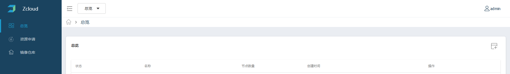
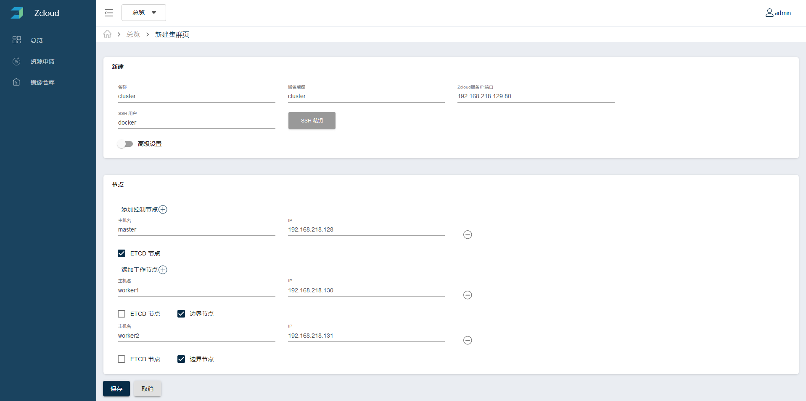
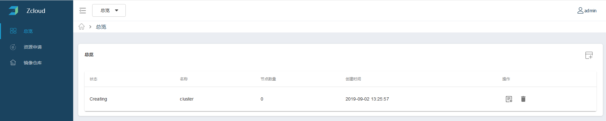
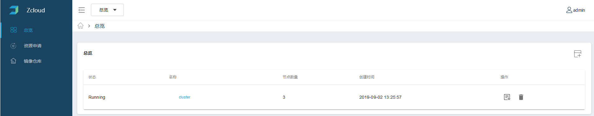
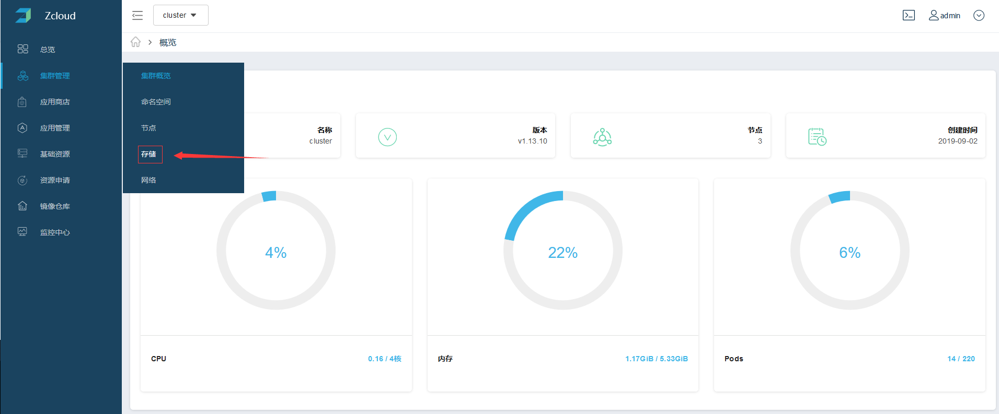

## 部署Zcloud
* 部署Zcloud
  创建/data/zcloud目录，执行下面的命令：

  ```
  docker rm -f zcloud 
  docker run --restart=always  -d -p 80:80 --name zcloud \
          -v /data/zcloud:/etc/db \
          zdnscloud/zcloud:master \
          -db /etc/db 
  ```

  注意：-db /etc/db参数为zcloud的k-v数据库存储目录。至此，Zcloud部署完成。
  

## 登录Zcloud

登录并开始使用Zcloud。在地址栏输入http://IP/login，用户名admin，密码默认为zcloud。


## 创建K8S集群

根据“节点需求”与“Docker安装与配置”完成3台集群节点服务器的准备。集群规划为1个控制节点，控制节点同时安装ETCD，两个worker节点，worker节点同时做为边界节点的角色，worker节点除系统盘外，还需要带有一块数据盘。数据盘做为k8s集群的存储使用。

**注意：**必须设置好免密登录，保存好保存好~/.ssh/id_rsa。

step1. 登录Zcloud成功后，点击下图中红框示意的新建集群按钮。



step2. 根据实现的集群节点信息，按下图中的格式进行添写。SSH私钥处上传~/.ssh/id_rsa。其中的IP与SSH用户名信息等，按实际环境填写。



点击保存后，页面会跳转到全局的集群列表页面，可以看到当前集群的状态。如下图：



当集群创建成功后，状态更新如下图中所示：



- ETCD集群容错表

建议在ETCD集群中使用奇数个成员,通过添加额外成员可以获得更高的失败容错。具体详情可以查阅[optimal-cluster-size](https://coreos.com/etcd/docs/latest/v2/admin_guide.html#optimal-cluster-size)。

| **集群大小** | **MAJORITY** | **失败容错** |
| ------------ | ------------ | ------------ |
| 1            | 1            | 0            |
| 2            | 2            | 0            |
| 3            | 2            | **1**        |
| 4            | 3            | 1            |
| 5            | 3            | **2**        |
| 6            | 4            | 2            |
| 7            | 4            | **3**        |
| 8            | 5            | 3            |
| 9            | 5            | **4**        |

## 配置集群存储

SSH登录worker1节点，查看数据盘的路径。

```#fdisk -l```

此时看到，数据盘的路径为/dev/sdb，执行以下命令对数据盘做初始化操作。

```docker run --rm  --privileged=true -v /dev/:/dev/ -e OSD_DEVICE=/dev/sdb ceph/daemon:latest-mimic zap_device```

看到如下输出代表数据盘初始化成功。

```
[root@localhost ~]# docker run --rm  --privileged=true -v /dev/:/dev/ -e OSD_DEVICE=/dev/sdb ceph/daemon:latest-mimic zap_device
2019-08-24 09:05:40  /opt/ceph-container/bin/entrypoint.sh: Zapping the entire device /dev/sdb
Creating new GPT entries.
GPT data structures destroyed! You may now partition the disk using fdisk or
other utilities.
The operation has completed successfully.
10+0 records in
10+0 records out
10485760 bytes (10 MB) copied, 0.0111043 s, 944 MB/s
2019-08-24 09:05:43  /opt/ceph-container/bin/entrypoint.sh: Executing partprobe on /dev/sdb
```

登录worker2节点执行相同的数据盘初始化操作。

在集群列表页，点击集群名称，进入集群。如下图红框所示：


如图所示，点击集群管理菜单中的存储菜单：



点击存储新建按钮，如图所示：


按照下图所示，创建lvm本地存储：


存储创建成功如图所示：


至此，使用Zcloud安装一个集群的基础环境已经完毕。

