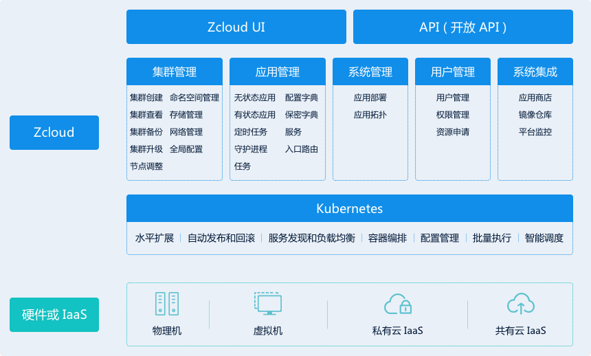

## 产品简介

Zcloud是容器云管理平台，可以实现容器集群的自动化部署、自动扩缩容、维护等功能。同时，Zcloud能轻松管理多个Kubernetes集群，满足IT需求并为DevOps团队提供支持。

您通过Zcloud可以：

- 快速的部署与管理Kubernetes集群
- 快速部署应用
- 快速扩展应用
- 快速进行应用的升级
- 节省资源，优化硬件资源的使用

### 为什么要使用Kubernetes？

Kubernetes是Google 2014年创建管理的，是Google 10多年大规模容器管理技术Borg的开源版本。Kubernetes不仅已经成为容器编排事实标准，它也正在迅速成为各类云和虚拟化厂商提供的标准基础架构。中国各大互联网企业也正在做应用的容器化改造，使其应用可以运行在Kubernetes集群上。

### 为什么要使用容器？
通过以下两个图对比。

传统的应用部署方式是通过插件或脚本来安装应用。这样做的缺点是应用的运行、配置、管理、所有生存周期将与当前操作系统绑定，这样做并不利于应用的升级更新/回滚等操作，当然也可以通过创建虚机的方式来实现某些功能，但是虚拟机非常重，并不利于可移植性。

新的方式是通过部署容器方式实现，每个容器之间互相隔离，每个容器有自己的文件系统 ，容器之间进程不会相互影响，能区分计算资源。相对于虚拟机，容器能快速部署，由于容器与底层设施、机器文件系统解耦的，所以它能在不同云、不同版本操作系统间进行迁移。

容器占用资源少、部署快，每个应用可以被打包成一个容器镜像，每个应用与容器间成一对一关系也使容器有更大优势，使用容器可以在build或release 的阶段，为应用创建容器镜像，因为每个应用不需要与其余的应用堆栈组合，也不依赖于生产环境基础结构，这使得从研发到测试、生产能提供一致环境。类似地，容器比虚机轻量、更“透明”，这更便于监控和管理。最后，

容器优势总结：

- **快速创建/部署应用：**与VM虚拟机相比，容器镜像的创建更加容易。
- **持续开发、集成和部署：**提供可靠且频繁的容器镜像构建/部署，并使用快速和简单的回滚(由于镜像不可变性)。
- **开发和运行相分离：**在build或者release阶段创建容器镜像，使得应用和基础设施解耦。
- **开发，测试和生产环境一致性：**在本地或外网（生产环境）运行的一致性。
- **操作系统：**可以在 Ubuntu、CentOS或其它任何相同物理架构与相同系统架构环境中运行。
- **Loosely coupled，分布式，弹性，微服务化：**应用程序分为更小的、独立的部件，可以动态部署和管理。
- **资源隔离**
- **资源利用：**更高效

### 使用Zcloud能做什么？

可以在物理机或虚拟机中部署多个Kubernetes集群，提供了以“**容器为中心的基础架构**”，满足在生产环境中运行应用的一些常见需求，如：

- 多Kubernetes集群管理
- 增强Kubernetes对存储系统的支持
- 增强Kubernetes原生的DNS系统
- 支持CI/CD等DevOps工作流
- 应用部署、扩容、升级、负载均衡
- 认证和授权
- 镜像仓库
- 监控
- 日志

## 产品功能

Zcloud提供了在生产环境集群部署的全栈化容器部署与管理平台，它的核心功能可以概括在以下的功能架构图中，了解具体功能说明，可以在产品功能一节中进行查看。

## 产品规划

Zcloud是容器云的完整解决方案。如果把Zcloud定义为容器云中心支持多内核同时运行的分布式操作系统，那么Kubernetes就是操作系统的内核(Linux kernel)。Zcloud同时在GUI、网络、存储、安全等方面对Kubernetes进行了加强。 

通过Zcloud对各Kubernetes版本支持的成熟度规划了两种版本（类似CentOS与RHEL）： 

**Community Edition** （ 社区版）=> **Enterprise Edition** （ 企业版）

