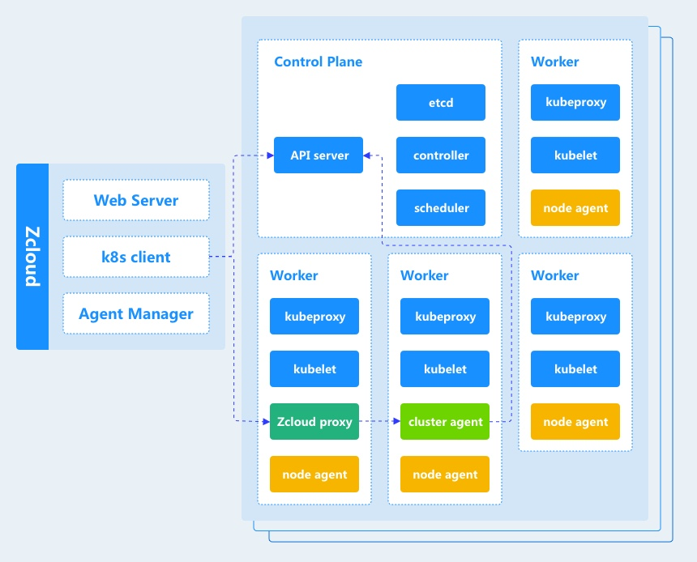

## 产品简介

Zcloud是一个企业级容器云的完整解决方案。可以为用户提供以多集群、多租户为核心的资源管理能力和以应用商店、可视化编排为核心的应用部署能力，帮助企业在生产环境中简便快捷的部署和管理容器，助力企业适应云原生，应用云原生，最终实现企业IT支撑系统的迭代升级，降低成本、提升企业竞争力。相较于原生Kubernetes，Zcloud集成优化后的网络、存储、监控模块，极大降低了其使用门槛，同时也为企业建立自己的私有容器云平台提供了基础支撑。

## 云原生

云原生是一种方法，用于构建和运行充分利用云计算模型优势的应用，这些应用被称之为云原生应用，与传统应用相比通常具有可自动化弹性扩展、持续交付、微服务化等特点；承载云原生应用运行的平台被称之为云原生基础设施；构建云原生应用所使用到的相关技术称之为云原生技术，代表技术包括容器、服务网格、微服务、不可变基础设施及声明式API等。借助于云原生技术构建的云原生应用和相关的云原生基础设施能够赋予企业更快的应用构建及交付能力，帮助企业降低运营成本，提升竞争力。

## 容器、容器云、Kubernetes

基于vm虚拟化技术的云，提高了资源效率，但是对应用的开发，部署以及运维基本没有带来变化。现代的商业模式要求所有的应用都支持快速迭代，以支持更多的终端，更多的用户。所以比vm虚拟化技术更小、更快的容器技术被广泛应用，基于容器技术的微服务已经成为复杂系统的基本架构，并导致了devops的流行。docker是目前容器技术的一种标准实现。同时，随着容器应用数量的增加，资源可共享、可调度、可伸缩已成为必然的需求，即容器云。容器云和虚拟机不同，它调度和管理的是企业的应用，极大的改变着应用的各个方面。Kubernetes已成为容器云的最佳实践。它是由Google 在2014年创建管理的，是Google 10多年大规模容器管理技术Borg的开源版本。目前为止，54%的全球500强企业已经部署了Kubernetes。

## Zcloud技术架构

下图说明了Zcloud的技术架构。该图描绘了管理一个kubernetes集群的Zcloud。

每个Zcloud组件的功能如下:
**Zcloud**
Zcloud server运行在独立的服务器上，它实现了以下功能:

- **Web server**
  Zcloud可视化管理WEB UI。提供用户、集群、存储、网络等功能的管理。
- **Agent manager**
  实现与集群内部的管理服务进行交互，控制集群与获取集群信息等。

**Zcloud proxy**
实现操作集群指令的转发。
**Cluster agent**
实现获取集群的状态等。

## Zcloud特点

用户使用Zcloud UI来创建Kubernetes集群，支持公有云、私有云、混合云，支持物理服务器、虚拟机。Zcloud支持企业使用统一认证系统中的账户进行身份验证并管理Kubernetes集群。IT管理员可以在单个页面对Kubernetes集群的健康状况和容量进行监控。Zcloud为DevOps工程师提供了一个直观的用户界面来管理他们的服务容器，用户不需要深入了解Kubernetes概念就可以开始使用Zcloud。 Zcloud包含应用商店，支持一键式部署常用应用，比如Mysql，Spark，Redis等。

**集群层面，通过Zcloud你可以：**

- 快速创建多个集群并进行管理
- 多租户支持，资源隔离
- 支持跨集群访问
- 可靠的存储组件，支持Ceph、LVM存储
- 可靠的网络组件，支持Flannel、Calico
- 高性能DNS组件，支持递归、转发
- 便捷的监控系统，快速定位问题
- 节省资源，优化硬件资源的使用

**应用层面，通过Zcloud你可以：**

- 应用秒级部署部署
- 高效弹性伸缩应用规模
- 应用快速升级和回滚
- 应用配置自动加载
- 应用健康检测
- 基于应用的调度策略
- 支持服务发现与负载均衡
- 开发，测试和生产环境一致性
- 应用与基础设施解耦
