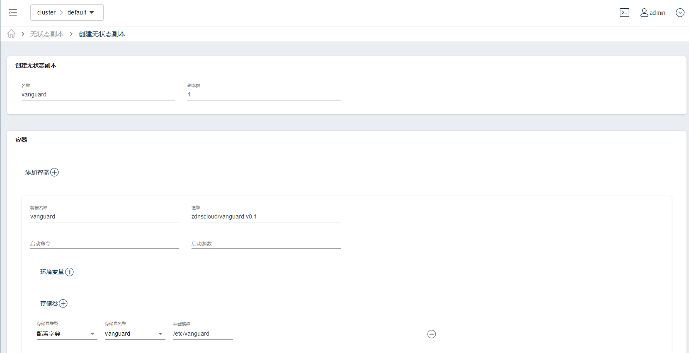

## 部署DNS-vanguard

1、选择集群


2、选择基础资源中的配置字典


3、创建配置字典


配置文件：vanguard

配置文件名称：vanguard.conf

单击文件编辑后，粘贴以下内容并保存：

```
server:
    addr: 
    - 0.0.0.0:53
    http_cmd_addr: 0.0.0.0:9000
    handler_count: 512 
    enable_tcp: false
enable_modules:
- query_log
- view
- cache
- forwarder
- recursor
logger:
    query_log: 
        enable: true
        qlog_extension: true
    general_log:
        enable: false
cache: 
    enable: true
    short_answer: false 
    prefetch: false
forwarder:
    forward_zone_for_view:
    - view: "default"
      zones:
      - name: "cn"
        forward_style: "rtt"
        forwarders:
        - 114.114.114.114:53
recursor:
- view: default
  enable: true
resolver:
  check_cname_indirect: false
```


最后保存配置字典，如图：


4、选择左侧菜单基础资源中的无状态副本


3、创建翻无状态副本


**创建页面按如下内容进行填写**

名称：vanguard

副本数：1

容器名称：vanguard

镜像：zdnscloud/vanguard:v0.1

**在容器一节，存储卷**

存储卷类型：配置字典

存储卷名称：vanguard

挂在路径：/etc/vanguard

**在容器一节，单击两次开放端口**

端口名称：dns-port

端口协议：UDP

端口：53

端口名称：cmd-port

端口协议：TCP

端口：9000

**在服务配置一节**

获取监控数据路径：/metrics

获取监控数据端口：9000

单击保存，如图所示：




4、部署vanguard svc

在弹出的对话框中选择确定，进入vanguard服务的创建页面。

单击名称为dns-port的内部端口打开按钮，保存即可。


5、部署vanguard的UDP服务入口

在上一布弹出的“服务已创建成功，是否创建关联访问入口？”单击确定按钮，进入UDP服务入口创建页面。


## 测试DNS服务

在任意到集群边界节点能通的机器上执行：

```
dig @192.168.218.130.zc.zdns.cn www.zdns.cn
```

效果如下图：

